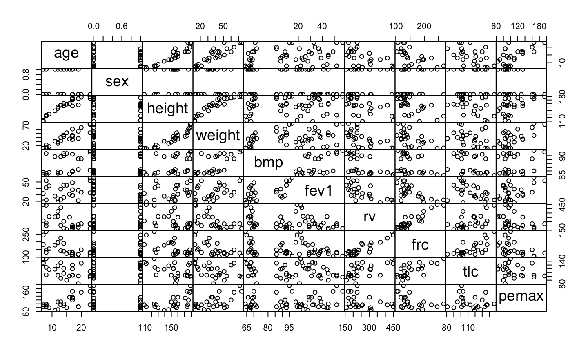
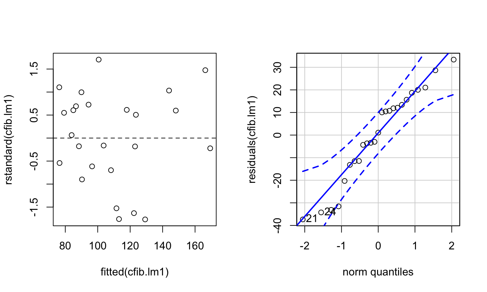
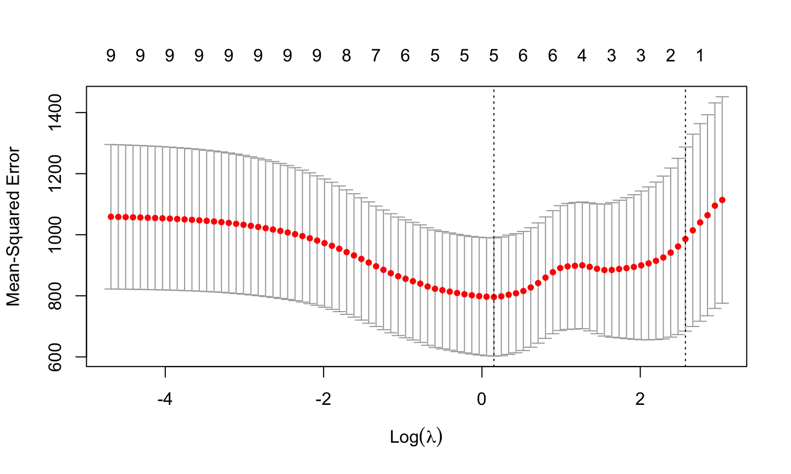
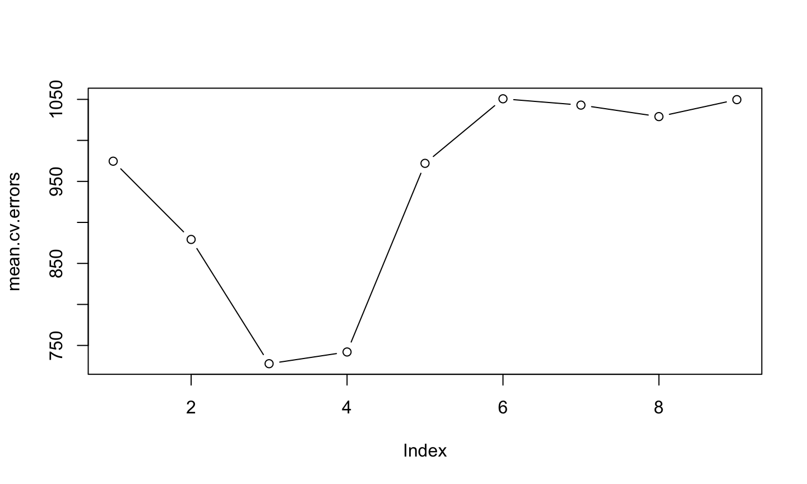

## Statistical inference - main types of inference

- Parameter estimation - finding a plausible range of values for a parameter of interest  - e.g. coefficient of a particular predictor

- Hypothesis testing - looking at the effect of a focal predictor - testing if the coefficient of the predictor is zero

- Predicting future values of the response from predictors

- Finding which predictors are associated with the response - _active_ predictors versus _inactive_ predictors


A good predictive model aids parameter estimation and hypothesis testing

Variable selection is a type of inference - one of many methods in general area of model selection


##  Example: Respiratory muscle strength in cystic fibrosis

<br>

Measurements of a number of clinical variables were taken on 25 patients with cystic fibrosis aged from 7 to 23 years. The response variable is maximum expiratory pressure (`pemax`).<footnote content = "Dalgaard 2008, Introductory Statistics with R, Springer; O’Neill et al. 1983,  Am. Rev. Respir. Dis., 128:1051–1054."></footnote>

- What variables are associated with (active predictors of) `pemax`?

- What is a useful prediction model for `pemax`?

<br>

_Response_ 

- `pemax`: maximum expiratory pressure


##  Example: Cystic fibrosis

- `age`: age (yr)
- `sex`:  coded 0: male, 1:female
- `height`: height (cm)
- `weight`: weight (kg)
- `bmp`: body mass pc. (% of normal) - indicator of malnutrition

_Lung function indicators_

- `fev1`: forced expiratory volume
- `rv`:  residual volume
- `frc`: functional residual capacity
- `tlc`: total lung capacity

<div class="notes">

Note: BMP = Wt/(Ht)^2 as percentage of age-specific median for normal individuals

</div>

##  Example: Cystic fibrosis - variables


```
## 'data.frame':	25 obs. of  10 variables:
##  $ age   : int  7 7 8 8 8 9 11 12 12 13 ...
##  $ sex   : int  0 1 0 1 0 0 1 1 0 1 ...
##  $ height: int  109 112 124 125 127 130 139 150 146 155 ...
##  $ weight: num  13.1 12.9 14.1 16.2 21.5 17.5 30.7 28.4 25.1 31.5 ...
##  $ bmp   : int  68 65 64 67 93 68 89 69 67 68 ...
##  $ fev1  : int  32 19 22 41 52 44 28 18 24 23 ...
##  $ rv    : int  258 449 441 234 202 308 305 369 312 413 ...
##  $ frc   : int  183 245 268 146 131 155 179 198 194 225 ...
##  $ tlc   : int  137 134 147 124 104 118 119 103 128 136 ...
##  $ pemax : int  95 85 100 85 95 80 65 110 70 95 ...
```


##  Example: Cystic fibrosis - all pairs plot




##  Example: Cystic fibrosis - summary statistics


```
##           mean         sd IQR   50%  n
## age     14.480  5.0589854   6  14.0 25
## sex      0.440  0.5066228   1   0.0 25
## height 152.800 21.5000000  35 156.0 25
## weight  38.404 17.8981256  26  37.2 25
## bmp     78.280 12.0052766  22  71.0 25
## fev1    34.720 11.1971723  18  33.0 25
## rv     255.200 86.0169557 117 225.0 25
## frc    155.400 43.7187984  56 139.0 25
## tlc    114.000 16.9681073  27 113.0 25
## pemax  109.120 33.4369058  45  95.0 25
```

##  Example: Cystic fibrosis - correlations


```
##          age   sex height weight   bmp  fev1    rv   frc   tlc pemax
## age     1.00 -0.17   0.93   0.91  0.38  0.29 -0.55 -0.64 -0.47  0.61
## sex    -0.17  1.00  -0.17  -0.19 -0.14 -0.53  0.27  0.18  0.02 -0.29
## height  0.93 -0.17   1.00   0.92  0.44  0.32 -0.57 -0.62 -0.46  0.60
## weight  0.91 -0.19   0.92   1.00  0.67  0.45 -0.62 -0.62 -0.42  0.64
## bmp     0.38 -0.14   0.44   0.67  1.00  0.55 -0.58 -0.43 -0.36  0.23
## fev1    0.29 -0.53   0.32   0.45  0.55  1.00 -0.67 -0.67 -0.44  0.45
## rv     -0.55  0.27  -0.57  -0.62 -0.58 -0.67  1.00  0.91  0.59 -0.32
## frc    -0.64  0.18  -0.62  -0.62 -0.43 -0.67  0.91  1.00  0.70 -0.42
## tlc    -0.47  0.02  -0.46  -0.42 -0.36 -0.44  0.59  0.70  1.00 -0.18
## pemax   0.61 -0.29   0.60   0.64  0.23  0.45 -0.32 -0.42 -0.18  1.00
```


##  Example: Cystic fibrosis - regression model

Model: multivariable linear regression 


```
##             Estimate Std. Error t value Pr(>|t|)
## (Intercept) 176.0582   225.8912  0.7794   0.4479
## age          -2.5420     4.8017 -0.5294   0.6043
## sex          -3.7368    15.4598 -0.2417   0.8123
## height       -0.4463     0.9034 -0.4940   0.6285
## weight        2.9928     2.0080  1.4905   0.1568
## bmp          -1.7449     1.1552 -1.5105   0.1517
## fev1          1.0807     1.0809  0.9998   0.3333
## rv            0.1970     0.1962  1.0039   0.3314
## frc          -0.3084     0.4924 -0.6264   0.5405
## tlc           0.1886     0.4997  0.3774   0.7112
```

```
## [1] Adjusted R-sq = 0.4197       p value = 0.032
```

##  Example: Cystic fibrosis - collinearity


Global P value small, no P values for model coefficients small?

Correlations among variables are interfering with estimated standard errors - _collinearity_

Check via _variance inflation factor_


```
##    age    sex height weight    bmp   fev1     rv    frc    tlc 
## 21.830  2.269 13.955 47.781  7.116  5.420 10.538 17.143  2.660
```


Values of VIF > 10 show concerning collinearity

VIF values show why individual P values are not smaller


##  Example: Cystic fibrosis - model assumptions

Check model assumptions



```
## [1] 21 24
```


## Variable selection - criteria and methods

Criteria applied to a model (well or not!) for deciding the fate of a variable:

- P value derived from some statistic ($t$, $\;F$, $\;\chi^2$)

- measure of model fit - mean squared error (residual mean square), adjusted $R^2$

- information criterion - AIC, BIC (combination of measure of model fit and penalty for larger model)


For these criteria, smaller is better, except for adjusted $R^2$, where larger is better


## Variable selection - criteria and methods


**Methods**

- stepwise methods - forwards, backwards, both (1960)
  - one variable added or removed at each step

- validation methods
  - measure how well models predict using new data (1990s)
  - randomly split data set into training and test sets
  - all subsets combined with k-fold cross-validation

- penalised estimation methods - model coefficient estimates forced towards zero
  - penalty term is based on magnitude of model coefficients
  - LASSO (1996)


## Variable selection - criteria and methods

Consensus view is use expert knowledge first to _simplify_ your model

- eliminate unnecessary predictors


Stepwise methods - can be useful but strongly criticised by some

- no statistical justification but if you must ...
- do not use P values for decisions 
  - hypothesis testing not appropriate for model selection as no a priori hypothesis is tested 
  - multiple testing problems
- use information criterion (AIC, BIC)


## Variable selection - criteria and methods

Validation methods

- common criterion is mean squared error
- good for comparing predictive capability of models and so variable selection
- choose appropriate "k" for k-fold cross-validation - one recommendation:
  - leave-one-out (i.e. N-fold c.v.) if n < 20
  - 10-fold c.v. for 20<n<100
  - 5-fold c.v. for n>100


Penalised estimation methods (e.g. LASSO)

- main goal is predictive capability of model
- good when many parameters or small sample


## Variable selection - criteria and methods

Each method also has its _limitations_ and _disadvantages_

- Stepwise methods 
  - can be undermined by collinearity
  - validity of multiple steps is questionable
- AIC and BIC rely on model being close to correct
- Cross-validation requires only independent splits for training and test data but different results for different "k"
- LASSO estimates are biased and no standard errors are available


##  Example: Cystic fibrosis - active predictors

- What variables are associated with (active predictors of) `pemax`?

LASSO



##  Example: Cystic fibrosis - active predictors


```
## 9 x 1 sparse Matrix of class "dgCMatrix"
##                 s0
## age     .         
## sex     .         
## height  .         
## weight  1.57131610
## bmp    -1.14686453
## fev1    1.29784065
## rv      0.07231485
## frc     .         
## tlc     0.15479400
```

Available output:

- active predictors and model coefficients
- no P values
- no standard errors


##  Example: Cystic fibrosis - prediction model

- What is a useful prediction model for `pemax`?

k-fold cross validation (k = 1, leave-one-out) with all subsets in each fold


```
## folds
##  1  2  3  4  5  6  7  8  9 10 11 12 13 14 15 16 17 18 19 20 21 22 23 
##  1  1  1  1  1  1  1  1  1  1  1  1  1  1  1  1  1  1  1  1  1  1  1 
## 24 25 
##  1  1
```


```
##         1         2         3         4         5         6         7 
##  974.6263  879.2297  727.7373  742.0240  972.0102 1050.7182 1043.0226 
##         8         9 
## 1029.0064 1049.6921
```


```
## [1] No. of predictors in final model = 3
```


##  Example: Cystic fibrosis - prediction model





##  Example: Cystic fibrosis - prediction model


```
## (Intercept)      weight         bmp        fev1 
##  126.333557    1.536475   -1.465406    1.108629
```


Look at terms in 4-predictor model from c.v. runs


```
## (Intercept)      weight         bmp        fev1          rv 
##  63.9466933   1.7489143  -1.3772433   1.5476984   0.1257152
```


Strange:

- both weight and bmp are in model when cor(weight, bmp) = 0.67

- coef of bmp is negative when cor(pemax, bmp) = 0.23

Possible overfitting?


<div class="notes">

Note: BMP = Wt/(Ht)^2 as percentage of age-specific median for normal individuals

cor(weight, bmp) = 0.67

cor(pemax, bmp) = 0.23

Strange both weight and bmp are in model and that coef of bmp is negative (despite weak +ve correlation between pemax and bmp)

</div>


##  Example: Cystic fibrosis - prediction model

Optimal model from cross-validation with all subsets fitted on full data set


```
##             Estimate Std. Error t value Pr(>|t|)
## (Intercept) 126.3336    34.7199  3.6387   0.0015
## weight        1.5365     0.3644  4.2162   0.0004
## bmp          -1.4654     0.5793 -2.5297   0.0195
## fev1          1.1086     0.5144  2.1553   0.0429
```

```
## [1] Adjusted R-sq = 0.5086       p value = 4e-04
```


##  Example: Cystic fibrosis - prediction model

For prediction models:

- some overfitting is not a problem

- some collinearity is not a problem


##  Example: Cystic fibrosis - active predictors

Simplify the model

- use logic from expert knowledge - consider groups of predictors

Lung function: `fev1`, `rv`, `frc`, `tlc`

Remove these other lung function indicators as a group

Model comparison criteria:

- AIC - overfits, better for prediction model

- BIC - penalises larger models harder, good for active predictors

- As models are _nested_, can use an $F$ test


##  Example: Cystic fibrosis - active predictors

Simplify the model contd


```
## [1] AIC full model: 242.05
```

```
## [1] AIC reduced model: 239.56
```

```
## [1] AIC_full - AIC_red = 2.49
```


```
## [1] BIC full model: 255.46
```

```
## [1] BIC reduced model: 248.09
```

```
## [1] BIC_full - BIC_red = 7.37
```

Model without lung function variables appears better


##  Example: Cystic fibrosis - active predictors

Simplify the model contd


$F$ test for nested models


```
## Analysis of Variance Table
## 
## Model 1: pemax ~ age + sex + height + weight + bmp + fev1 + rv + frc + 
##     tlc
## Model 2: pemax ~ age + sex + height + weight + bmp
##   Res.Df     RSS Df Sum of Sq      F Pr(>F)
## 1     15  9731.2                           
## 2     19 12129.2 -4     -2398 0.9241 0.4758
```

Smaller model is no worse than larger model


##  Example: Cystic fibrosis - active predictors


```
##             Estimate Std. Error t value Pr(>|t|)
## (Intercept) 280.4482   124.9556  2.2444   0.0369
## age          -3.0750     3.6352 -0.8459   0.4081
## sex         -11.5281    10.3720 -1.1115   0.2802
## height       -0.6853     0.7962 -0.8607   0.4001
## weight        3.5546     1.5281  2.3261   0.0312
## bmp          -1.9613     0.9263 -2.1174   0.0476
```

```
## [1] Adjusted R-sq = 0.429       p value = 0.0064
```

Collinearity still present - possibly obscuring relationships


```
##       age       sex    height    weight       bmp 
## 12.715251  1.038066 11.015970 28.123150  4.648941
```


##  Example: Cystic fibrosis - active predictors

Simplify the model contd

Remove `age`


```
##             Estimate Std. Error t value Pr(>|t|)
## (Intercept) 251.3973   119.2859  2.1075   0.0479
## sex         -11.5458    10.2979 -1.1212   0.2755
## height       -0.8128     0.7762 -1.0472   0.3075
## weight        2.6947     1.1329  2.3787   0.0275
## bmp          -1.4881     0.7330 -2.0302   0.0558
```

```
## [1] Adjusted R-sq = 0.4371       p value = 0.0033
```

Collinearity still present


```
##       sex    height    weight       bmp 
##  1.038062 10.620847 15.678850  2.953131
```


##  Example: Cystic fibrosis - active predictors

- Perhaps no neat ending here in specifying active predictors

  - cor(height, weight) = 0.92 so possibly one should have been removed at the start

- Different methods may lead to different results


## Inference after model selection - Caveats

- Full fitted model is only model giving accurate standard errors and P values

- Data-driven model selection, esp. stepwise methods, produce estimated standard errors of coefficients and P values that are too small<footnote content = "Harrell 2015, Regression Modeling Strategies, Springer, 2nd ed., s. 4.3"></footnote> 

- Most parsimonious model may not give best parameter estimates or predictions<footnote content = "Leeb & P&ouml;tscher 2005 https://doi.org/10.1017/S0266466605050036"></footnote>


##  Variable selection - Recommendations

- In study design, use expert knowledge to list predictors (do not use the data later to "help"!)

- Plan to collect adequate data on all variables

- Pre-specify a small number of candidate models

- Avoid including too many predictors for your sample size


##  Variable selection - Recommendations contd

- If variable selection is necessary:

  - use penalised or resampling methods or

  - if you must use stepwise methods

    - use a limited, structured approach (e.g. consider groups of predictor variables)
  
    - use _minimal_ backwards elimination steps if you want parsimony (active predictors) rather than accuracy (good predictions)

    - validate the model using a resampling method or external test data<footnote content = "Harrell 2015, Regression Modeling Strategies, Springer, 2nd ed., s. 4.12"></footnote>
  
##  Variable selection - Recommendations contd

  
- What is the role of modelling in your field?  

  - systems biology - complex problems addressed by computational modelling and simulation<footnote content = "Macleod 2018 https://doi.org/10.1007/s40656-017-0183-9"></footnote>
  
  - business - big data - Netflix Prize (100 million records)<footnote content = "Hastie 2015 Statistical learning with big data https://web.stanford.edu/~hastie/TALKS/SLBD_new.pdf"></footnote>
  
  - clinical science and health - diagnostic and prognostic inferences ... for care decisions ... policy<footnote content = "Henley 2020 https://doi.org/10.1080/24709360.2019.1618653"></footnote>
  
  - more generally - how statistical modelling decisions connect with answering scientific questions<footnote content = "Navarro 2019 https://doi.org/10.1007/s42113-018-0019-z"></footnote>
  
  

##  Variable selection - future seminar topics?

Many issues not raised:

- how many variables is it feasible to start with in a model?

- after you've done model selection, how much can you trust P values for model parameter estimates?

- what methods can be used for models with multiple categorical predictor variables?

- what about mixed models with fixed and random effects - i.e. where the data records are not independent, such as observations made on subjects in different groups?

- what methods can be used with other types of model - e.g. non-linear models or where response variable is binary, small count, categorical, ...?


##  Useful resources

**Books**

Dalgaard P 2008. _Introductory Statistics with R._ Springer, 2nd ed. (Contains description of example data set and analysis notes)

Harrell F 2015. _Regression Modeling Strategies,_ Springer, 2nd ed.

James G et al. 2013. _An Introduction to Statistical Learning - with Applications in R._ Springer. https://doi.org/10.1007/978-1-4614-7138-7 **Extremely useful** (Free download available here: http://faculty.marshall.usc.edu/gareth-james/ISL/)


##  Useful resources

**Journal articles**

Heinze G & Dunkler D 2017. Five myths about variable selection. _Transplant International,_ 30(1), 6–10. https://doi.org/10.1111/tri.12895

Heinze G et al. 2018. Variable selection – A review and recommendations for the practicing statistician. _Biometrical Journal,_ 60(3), 431–449. https://doi.org/10.1002/bimj.201700067

Henley S et al. 2020. Statistical modeling methods: challenges and strategies. _Biostatistics and Epidemiology,_ 4(1), 105–139. https://doi.org/10.1080/24709360.2019.1618653

Leeb H & P&ouml;tscher B M 2005. Model selection and inference: facts and fiction. _Econometric Theory_ 21(1), 21-59. https://doi.org/10.1017/S0266466605050036


##  Useful resources

**Journal articles**

Sauerbrei W et al. 2020. State of the art in selection of variables and functional forms in multivariable analysis—outstanding issues. _Diagnostic and Prognostic Research,_ 4(1). https://doi.org/10.1186/s41512-020-00074-3


